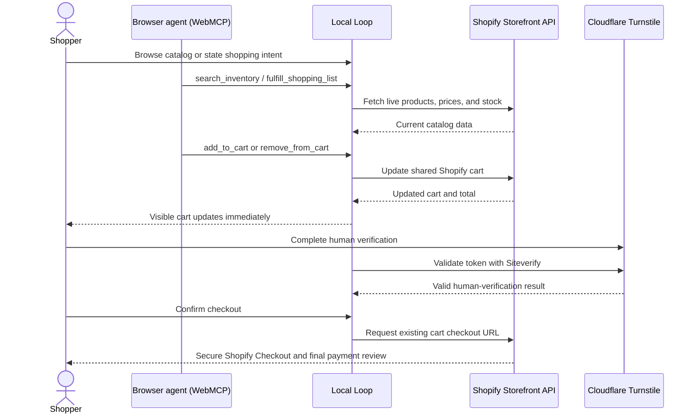

# Local Loop — Smart Local Commerce Agent

> A live Shopify storefront where a shopper and a browser agent build the same cart together — with the shopper retaining control of checkout.

[**Open the live app**](https://web-mcp-mu.vercel.app/) · [**Watch the 90-second demo**](https://youtu.be/ER8LuhkWXhM) · [**View the public repository**](https://github.com/Saurabhkaran11/web-mcp)

## The problem

Shopping is full of small, repetitive tasks: searching a catalog, comparing prices, checking stock, and assembling a cart. Browser agents can help, but only when a site gives them reliable, structured actions instead of making them guess which buttons to click.

## The solution

Local Loop is a WebMCP-enabled commerce experience. A shopper can use the visible storefront, while a compatible browser agent can search live inventory, prepare a shopping list, and update the exact same Shopify cart. Every product, stock level, cart change, and checkout handoff remains visible to the shopper.

The app does not collect payment details. It hands the shopper to Shopify Checkout only after an explicit confirmation and a short human-verification step.

## Why WebMCP is a strong fit

Commerce is stateful: an agent needs to work with the shopper's active cart, live catalog, prices, and available stock. WebMCP lets Local Loop expose those actions as named, schema-validated browser tools. The agent calls the same handlers used by the visible interface, so agent actions immediately update the cart the shopper sees.

This makes a new shared workflow possible: the shopper expresses intent — for example, “find two cold brews and honey under my budget” — and the agent handles discovery and cart preparation while the shopper reviews, changes, or removes items at every point.

## What people and agents can do together

- A shopper browses the live Shopify catalog and manages the visible cart.
- A browser agent searches products by keyword, category, budget, and availability.
- The agent adds or removes live Shopify variants from the same cart.
- The agent can prepare a multi-item shopping list; the shopper reviews the matched products before adding them.
- The shopper completes a short Cloudflare Turnstile check before checkout can be prepared.
- Shopify remains the only place where payment and final order review happen.

## Core checkout sequence



## WebMCP tools

| Tool | Type | What it does |
| --- | --- | --- |
| `search_inventory` | Read | Searches live Shopify inventory by product, category, budget, and stock. |
| `add_to_cart` | Write | Adds an in-stock Shopify variant to the shared cart. |
| `get_cart` | Read | Returns the shared cart, quantities, and live total. |
| `remove_from_cart` | Write | Removes a variant from the shared cart. |
| `fulfill_shopping_list` | Write | Matches several requested items against live inventory, then adds approved matches. |
| `checkout` | Write | Prepares a Shopify Checkout URL only after explicit confirmation and the shopper's human verification. |
| `get_order_status` | Read | Directs the shopper to Shopify's secure order-history experience; Local Loop does not retain private order data. |

## WebMCP registration

The tool contracts live in [`app/commerce.tools.ts`](app/commerce.tools.ts). In [`app/page.tsx`](app/page.tsx), each contract is bound to the same handler used by the visible storefront, then registered with the browser's `modelContext` through the WebMCP React helper:

```tsx
const webMCPTools = useMemo(
  () => [
    bindToolHandler(searchInventoryContract, searchInventory),
    bindToolHandler(addToCartContract, addToCart),
    // …the remaining shared cart and checkout tools
  ],
  [searchInventory, addToCart],
);

useWebMCPTools(webMCPTools);
```

This is why a human click and an agent tool call result in the same Shopify-cart update instead of two disconnected experiences.

## Safety and trust boundaries

- **Live inventory:** Product data comes from Shopify through a server-side route and refreshes in the storefront every 30 seconds.
- **Shared but private cart:** The Shopify cart ID is kept in an HTTP-only, same-site cookie; the browser agent and shopper act on one session cart.
- **No payment collection:** Local Loop never asks for, stores, or processes payment details.
- **Explicit checkout:** The WebMCP checkout tool requires `confirm: true`; the final order and payment decision happen in Shopify.
- **Bot protection:** Cloudflare Turnstile is validated server-side. A signed, five-minute browser verification is required before a checkout URL is released.
- **Baseline abuse guard:** Catalog, cart, and verification routes are request-limited on active server instances. A high-traffic merchant should use a shared, durable limiter.
- **Private credentials:** Shopify and Turnstile secret keys stay on the server. Only the Turnstile site key is intentionally public in the browser.

## How it is built

- **Next.js 16, React 19, TypeScript, and Tailwind CSS** for the storefront.
- **WebMCP + Zod contracts** for structured, validated browser-agent tools.
- **Shopify Storefront API and Cart API** for live products, stock, cart state, and the secure checkout handoff.
- **Cloudflare Turnstile** for human verification before checkout.
- **Vercel** for production hosting and anonymous page-view analytics.

## Test the live demo

### Human storefront test

1. Open [Local Loop](https://web-mcp-mu.vercel.app/).
2. Add a product from the live catalog, or use **Shopping List Mode** with entries such as `1 honey under 15` and `2 cold brews under 12`.
3. Review the visible Shopify cart and remove an item if needed.
4. Complete the **Protected checkout** human check.
5. Confirm that Shopify Checkout opens. Do not enter payment information for this demo.

### WebMCP tool test

1. Open the live URL in ChatGPT's in-app browser, or Google Chrome with WebMCP enabled (`chrome://flags/#enable-webmcp-testing`).
2. Use a WebMCP-compatible client or the **WebMCP – Model Context Tool Inspector**.
3. Confirm that all seven tools are listed.
4. Run `search_inventory`, then `add_to_cart` with the exact `id` returned by the search, then `get_cart`.
5. Complete the visible human check before calling `checkout` in the same browser session.

## Run locally

### Prerequisites

- A Shopify store with products and a private Storefront API token.
- A Cloudflare Turnstile widget configured for `localhost` and your deployed domain.
- Node.js 20 or later.

### Setup

1. Install dependencies:

   ```bash
   npm install
   ```

2. Copy `.env.example` to `.env.local` and supply your own values:

   ```env
   SHOPIFY_STORE_DOMAIN=your-store.myshopify.com
   SHOPIFY_STOREFRONT_PRIVATE_ACCESS_TOKEN=your-private-storefront-token
   SHOPIFY_STOREFRONT_API_VERSION=2026-07
   NEXT_PUBLIC_TURNSTILE_SITE_KEY=your-cloudflare-turnstile-site-key
   TURNSTILE_SECRET_KEY=your-cloudflare-turnstile-secret-key
   ```

3. Start the development server:

   ```bash
   npm run dev
   ```

4. Open `http://localhost:3000`.

Never commit `.env.local`, a Shopify private token, or a Turnstile secret key.

## Environment variables

| Variable | Where it is used | Safe to expose? |
| --- | --- | --- |
| `SHOPIFY_STORE_DOMAIN` | Server-side Shopify requests | No |
| `SHOPIFY_STOREFRONT_PRIVATE_ACCESS_TOKEN` | Server-side Shopify requests | No |
| `SHOPIFY_STOREFRONT_API_VERSION` | Server-side Shopify requests | No |
| `NEXT_PUBLIC_TURNSTILE_SITE_KEY` | Browser Turnstile widget | Yes |
| `TURNSTILE_SECRET_KEY` | Server-side Siteverify validation | No |

For Vercel, add all five values to **Production** and **Preview**. Deploy again after changing a public environment variable so it is included in the browser build.

## Sponsor integrations

| Product | How Local Loop uses it |
| --- | --- |
| WebMCP / Google Chrome | Seven structured browser tools for human-and-agent commerce. |
| Shopify | Live catalog, stock, cart, checkout, and payment handoff. |
| Vercel | Hosting and Web Analytics. |
| Cloudflare | Turnstile checkout protection. |

## Current scope and next steps

Local Loop is a functional portfolio demo with a live catalog and real Shopify cart. A full merchant deployment would additionally need customer accounts, inventory webhooks, order workflows, audit logs, privacy documentation, accessibility review, and merchant approval before accepting real customer orders.

## License

This repository is released under the license in [LICENSE](LICENSE).
